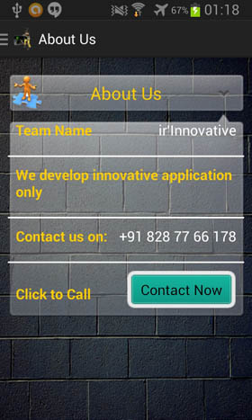

Android-Box-Layout
==================

 <table>
        <tr>
            <td>
                <h1>
                    Android Box Layout Custom View</h1>
            </td>
        </tr>
    </table>
    <table>
        <tr>
            <td>
                <b>  Android: </b> Box Layout to put contents in a glossy box with ultimate view (Check out
                screen shots. If its taking more time to load then just download from root directory of trunk)
            </td>
        </tr>
         <tr>
            <td>
                <table>
                    <tr>
                        <td>
                            Screenshot 1:
                             
                            
                        </td>
                        <td>
                            Screenshot 2:
                             
                            
                        </td>
                    </tr>
                    <tr>
                        <td>
                            Screenshot 3:
                             
                            
                        </td>
                        <td>
                            Screenshot 4:
                             
                            
                        </td>
                    </tr>
                </table>
            </td>
        </tr>
        <tr>
            <td>
                <h2>
                    What is Box Layout</h2>
            </td>
        </tr>
        <tr>
            <td>
                <ul>
                    <li>Box Layout is a custom view for android.</li>
                    <li>It is available as library under MIT license.</li>
                    <li>Android app which needs to show few informaiton about system or user requires a
                        container.Box Layout fits into this requirement at its best. </li>
                    <li>This layout provides a box like structure with easy method of integration to any
                        android app.</li>
                        <li>All the images are glossy images. You can put any background image and the total look
                        and feel will be different.</li>
                </ul>
            </td>
        </tr>
        <tr>
            <td>
                <b>Description</b>
                <ul>
                    <li>First row is header- One can put title and their own images on it. (See screenshot
                        for example)</li>
                    <li>Next four rows are row of body.</li>
                    <li>Out of four body row three rows are having Text views arranged in two columns. One
                        can easily set text on Text View to customize as per thier needs. (See code snippet
                        for the same)</li>
                    <li>Last row is having Button on right side to perform such action.</li>
                </ul>
            </td>
        </tr>
    </table>

<b> How to use it </b>
 1. Download project.
 2. Import it on eclipse workspace.
 3. If it prompts for min-require sdk is 11 then set the manifest "min-require sdk to 11"
 4. Create a sample android application in your workspace.
 5. Right click on project-->Properties--> Android (Left panel)-->in the bottom of it select "Add library"
	--> Select "Box layout"--> Click Ok.
 6. Open your main.xml and put this line there--
	
	<com.irinnovative.boxlayout.BoxLayout
        android:id="@+id/boxBackupContact"
        android:layout_width="wrap_content"
        android:layout_height="wrap_content" >
    </com.irinnovative.boxlayout.BoxLayout>
    
  7.	Now open your MainActivity.java file and perform follwoing steps-
 	i)	Initialize Box Layout outside of method but inside the class as 
 		
 		private BoxLayout box;
 	
 	ii)	In OnCreate method use findview by id to get instance of box layout
 	
 		box = (BoxLayout) findViewById(R.id.boxBackupContact);	
 	 
 	iii) Assign text to all cell in OnCreate method as
 	
 		box.setTitle(R.drawable.backup_contact, "Contact Backup", 0);
		box.setRow1("Last backup", "10-Dec-2013");
		box.setRow2("Contact us on:", "irfaan.aa@gmail.com");
		box.setRow3(
				"We recommend to take backup of your contact on weekly basis.",
				null);
		box.setRow4("Click to Backup", "Backup Now");
		box.showDevider(true);
		
  8.	For more detail download "SampleBoxLayout".
  9.	To assign listener to button you can get object of button by calling

	Button btn=box.getBodyCell42();
	
  10. In the same all the textview are exposed using this method for ex if you need to change styling
			of cell23 then you might go in this way-
			
			TextView tv=box.getBodyCell23();
			//	tv.setColor(#FF0000)... do your stuff here
			
			
  11.	For more customization head over to library and edit the res/layout_box.xml file as per your
			basic skills.
			
  12.	Please note that all the codes are available under license of MIT and you need to get
			written permission before publishing any app derived from this library. Contact me on irfaan.aa@gmail.com